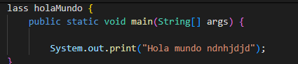

# Programacion
## class 01
-git 
-choco
-vscode
## class 02
 - markdown 
**negritas**
**subrayados**
# clase 022
mi primer programa en java:
```java
lass holaMundo {
    public static void main(String[] args) {
      
        System.out.print("Hola mundo ndnhjdjd");
}
}  
```

pponer imagenes en el markdopw 

link
[buscador de google](https://google.com)